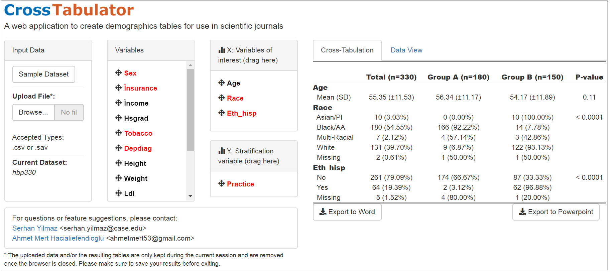

## Introduction 
CrossTabulator is a R shiny based web application to generate summary tables from input data easily. The generated tables contain descriptive statistics about the selected variables after stratification. If you are interested in creating demographics tables through a user-friendly online interface, please visit the [CrossTabulator Web Application](https://serhan-yilmaz.shinyapps.io/crosstabulator/).

